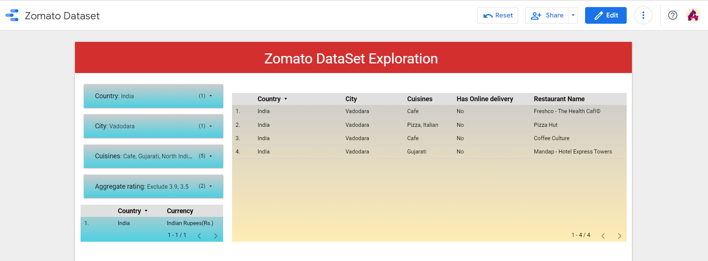
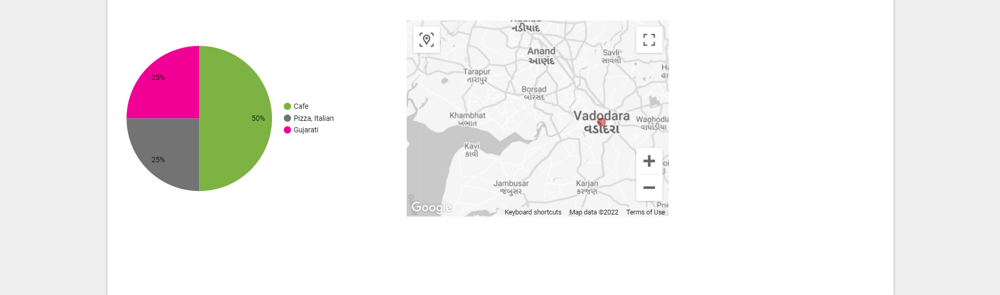
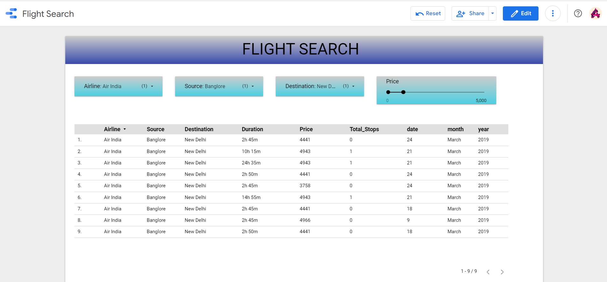

# EDA-Projects
Performed EDA and Feature Engineering along with the data visualizing it in Google Data Studio

Datasets used:
1) Zomato Dataset
2) Flight Schedule

Site links to Google Data Studio:
1) Zomato: https://datastudio.google.com/reporting/465fe358-97cd-44d8-8ec2-c90e380ee8ee
2) Flight: https://datastudio.google.com/reporting/4e8b2a6b-f5cb-482e-9885-dbbcd325dfc6

A glance at the analysis:

**Zomato Dataset:**

**Flight Dataset:**

